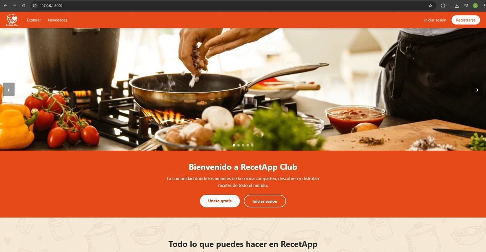
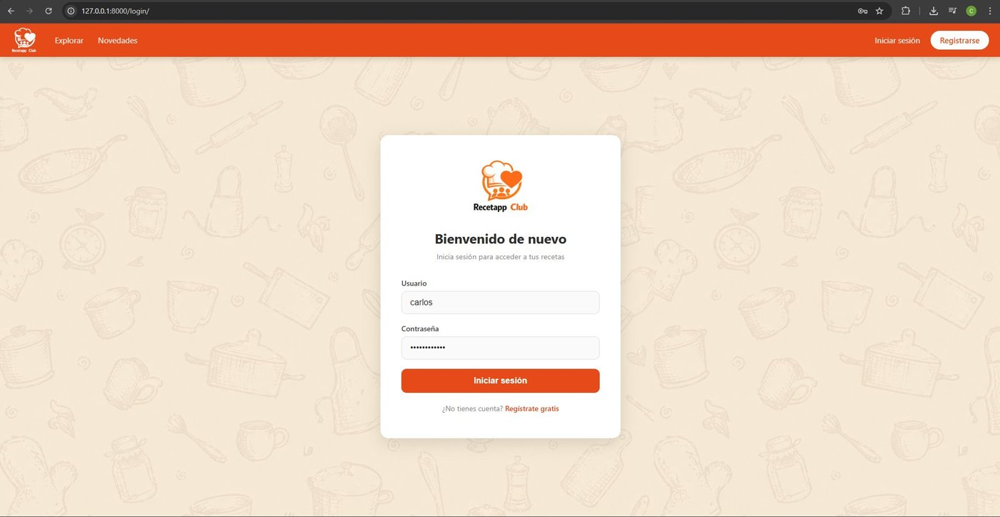
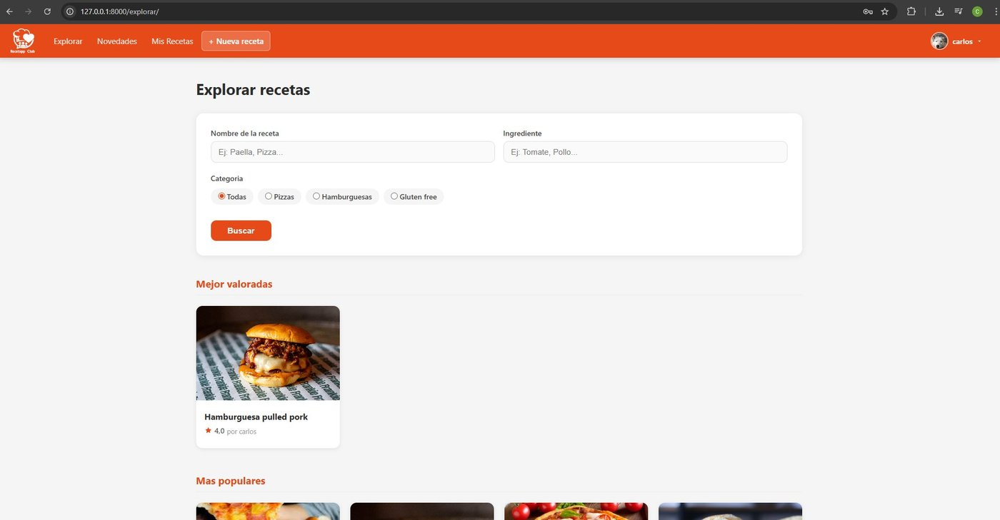
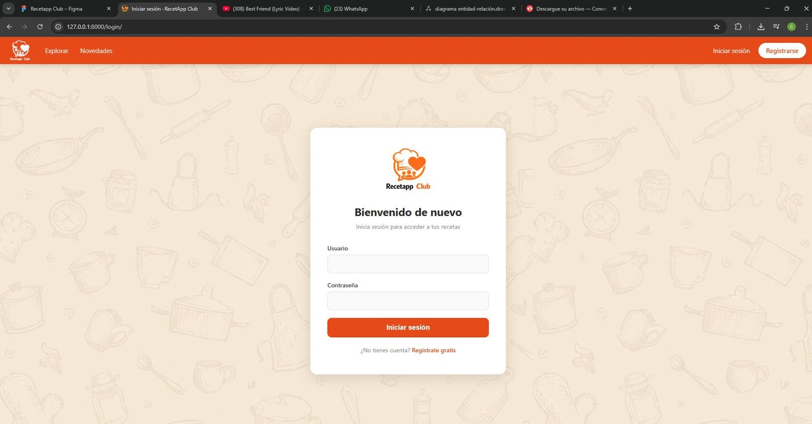
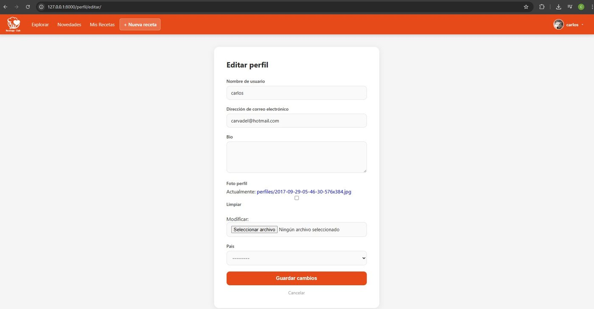

# RecetAppClub · Backend (Django + DRF)

> Plataforma social de recetas con backend Django y cliente Android nativo. Los usuarios crean recetas, valoran las de otros, guardan favoritas, comentan e interactúan con likes.

**Aplicación en producción:** [carvalx.pythonanywhere.com](https://carvalx.pythonanywhere.com/)

**Cliente Android:** [github.com/Carvalx/recetappclub-android](https://github.com/Carvalx/recetappclub-android)

---

## Vista previa



| Login | Registro |
|---|---|
|  |  |

| Explorar recetas | Perfil de usuario |
|---|---|
|  |  |

---

## Arquitectura

```
[ Web (Django Templates) ]──┐
                            ├──► [ Backend Django ]──► PostgreSQL
[ App Android (Kotlin) ]────┘     ├─ Vistas web (sesión)
                                  └─ API REST (DRF + Token Auth)
```

El backend expone simultáneamente dos interfaces sobre los mismos modelos:
- **Frontend web** servido con Django Templates, autenticación por sesión y formularios.
- **API REST** con Django REST Framework y autenticación por Token, consumida por el cliente Android.

---

## Stack técnico

**Backend**
- Python 3 · Django 5.2
- Django REST Framework 3.17
- PostgreSQL (psycopg2)
- Pillow para procesamiento de imágenes
- python-decouple para configuración por entorno
- django-countries

**Frontend web**
- Django Templates · HTML5 · CSS3 · JavaScript
- Bootstrap

**Cliente móvil** ([repo aparte](https://github.com/Carvalx/recetappclub-android))
- Kotlin · Android SDK
- Retrofit + OkHttp para consumo de la API REST
- Corrutinas para llamadas asíncronas
- Glide para carga de imágenes

**Despliegue**
- PythonAnywhere

---

## Modelo de datos

Seis modelos relacionados con relaciones uno-a-muchos y muchos-a-muchos:

| Modelo | Descripción | Relaciones |
|---|---|---|
| `Usuario` | Extiende `AbstractUser` con foto de perfil, país y bio | — |
| `Categoria` | Tipos de receta | — |
| `Receta` | Entidad principal con título, descripción, instrucciones e imagen | FK a Usuario y Categoria, M2M likes y guardadas |
| `Ingrediente` | Ingredientes de una receta | FK a Receta |
| `Comentario` | Comentarios de usuarios | FK a Receta y Usuario |
| `Valoracion` | Puntuación numérica única por usuario por receta | FK a Receta y Usuario, `unique_together` |

---

## Endpoints principales de la API

| Método | Endpoint | Descripción |
|---|---|---|
| POST | `/api/registro/` | Registro de usuario, devuelve token |
| POST | `/api/login/` | Login, devuelve token |
| GET | `/api/perfil/` | Datos del usuario autenticado |
| PATCH | `/api/perfil/foto/` | Subida de foto de perfil (multipart) |
| GET, POST | `/api/recetas/` | Listar (con búsqueda y filtro por categoría) y crear |
| GET, PUT, DELETE | `/api/recetas/<id>/` | Detalle, editar, eliminar (autor) |
| POST | `/api/recetas/<id>/like/` | Toggle de like |
| POST | `/api/recetas/<id>/valorar/` | Valorar receta (voto único por usuario) |
| POST | `/api/recetas/<id>/guardar/` | Toggle de guardado en favoritos |
| POST | `/api/recetas/<id>/comentar/` | Añadir comentario |
| POST | `/api/recetas/<id>/ingredientes/` | Añadir ingrediente |
| GET | `/api/categorias/` | Listar categorías |
| GET | `/api/mis-recetas/` | Mis creaciones y mis favoritas |

**Autenticación:** los endpoints protegidos requieren la cabecera `Authorization: Token <token>`.

---

## Funcionalidades implementadas

- Autenticación por Token (DRF authtoken) y por sesión Django
- CRUD completo de recetas con permisos basados en autoría
- Búsqueda por texto en título y descripción, filtrado por categoría
- Sistema de likes con toggle atómico
- Sistema de guardado en favoritos (M2M)
- Comentarios sobre recetas
- Valoraciones con restricción de unicidad (`unique_together`)
- Subida de imágenes para recetas y perfiles (multipart)
- Vistas genéricas de DRF (`ListCreateAPIView`, `RetrieveUpdateDestroyAPIView`)
- Permisos diferenciados por método (`IsAuthenticatedOrReadOnly`)

---

## Instalación local

```bash
# 1. Clonar el repo
git clone https://github.com/Carvalx/proyecto-recetappClub.git
cd proyecto-recetappClub

# 2. Entorno virtual
python -m venv venv
source venv/bin/activate          # Linux/Mac
# venv\Scripts\activate            # Windows

# 3. Dependencias
pip install -r requirements.txt

# 4. Variables de entorno
cp .env.example .env
# Editar .env con tus valores reales

# 5. Base de datos (necesita PostgreSQL corriendo)
python manage.py migrate
python manage.py createsuperuser

# 6. Servidor de desarrollo
python manage.py runserver
```

Ver [`.env.example`](.env.example) para las variables de entorno necesarias.

---

## Estructura del proyecto

```
recetapp_club/
├── recetapp_club/        # Configuración del proyecto Django
│   ├── settings.py
│   └── urls.py
├── recetas/              # App principal
│   ├── models.py         # 6 modelos relacionales
│   ├── views.py          # Vistas web
│   ├── api_views.py      # Endpoints REST
│   ├── serializers.py    # Serializers de DRF
│   ├── forms.py          # Formularios web
│   └── urls.py           # Rutas (web + API)
├── templates/            # Plantillas HTML
├── static/               # Recursos estáticos
├── docs/                 # Capturas de pantalla
└── requirements.txt
```

---

## Sobre el proyecto

Proyecto desarrollado de forma autónoma como práctica integral de desarrollo backend con Django y consumo desde cliente móvil Android. Cubre el ciclo completo: modelado de datos relacional, autenticación por token, diseño de API REST, manejo de archivos multipart, lógica de negocio, despliegue en producción y consumo desde un cliente externo.

---

**Autor:** Carlos Macero
[LinkedIn](https://linkedin.com/in/carlos-macero) · [GitHub](https://github.com/Carvalx)
